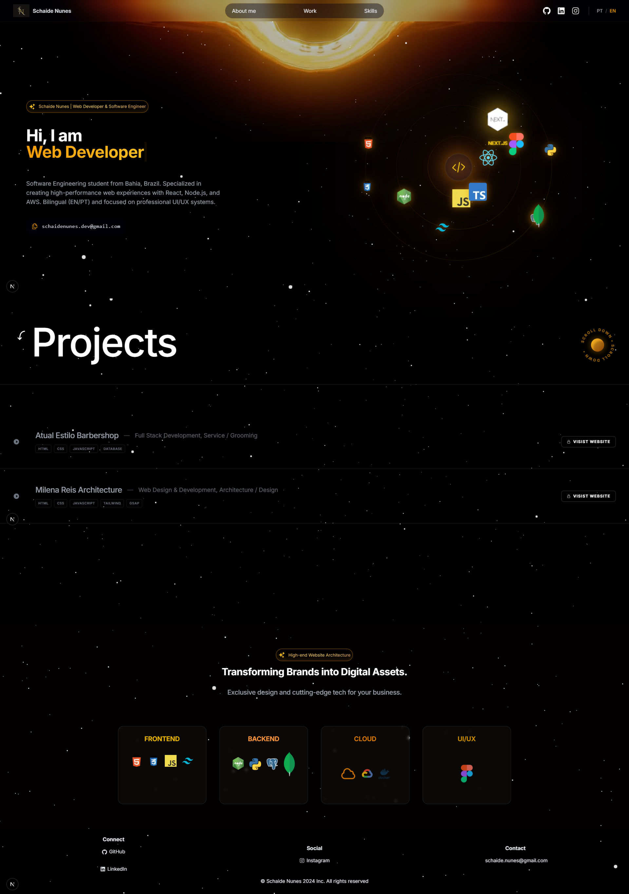
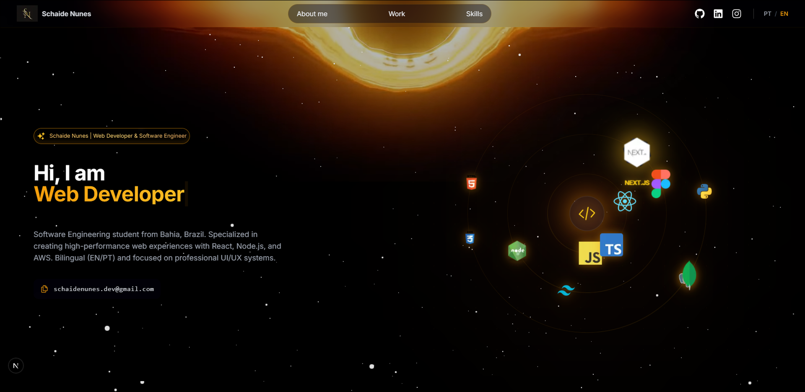
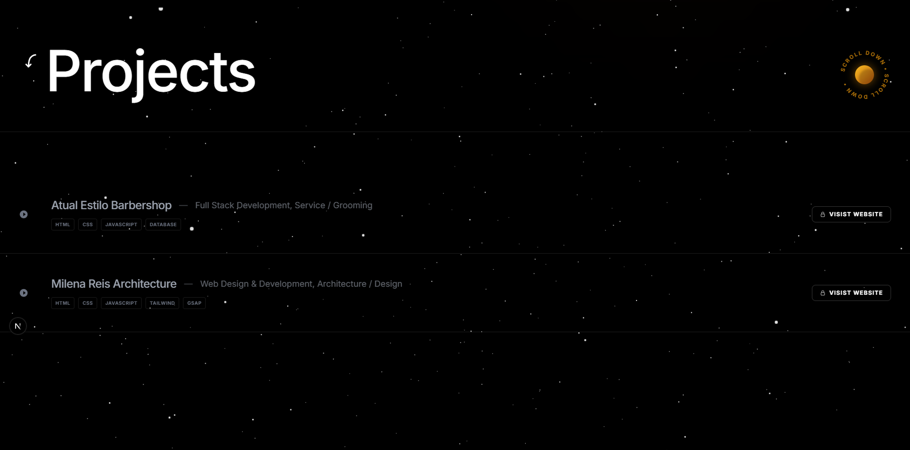
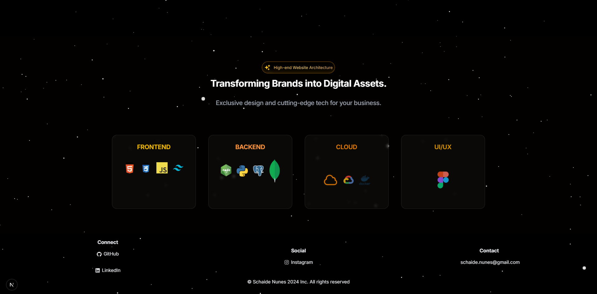

# 🚀 Schaide Nunes | Full Stack Web Developer
 
 Welcome to my personal portfolio! This repository contains the source code for my 3D interactive portfolio built with Next.js, Framer Motion, and GSAP. It's designed to showcase my projects, skills, and experience with a unique space-themed aesthetic.
 
 ## 🌟 Live Demo
 
 You can check out the live version of my portfolio here: [schaidenunes.com](https://schaidenunes.com)
 
 ## 🛠️ Technologies & Tools
 
 This project was built using a modern web development stack:
 
 - **Framework:** [Next.js 14](https://nextjs.org/) (App Router)
 - **Styling:** [Tailwind CSS](https://tailwindcss.com/)
 - **Animations:** [Framer Motion](https://www.framer.com/motion/) & [GSAP](https://gsap.com/)
 - **3D Graphics:** [Three.js](https://threejs.org/) & [React Three Fiber](https://docs.pmnd.rs/react-three-fiber/getting-started/introduction)
 - **Language:** [TypeScript](https://www.typescriptlang.org/)
 
 ## 🚀 Features
 
 - **Immersive 3D Background:** Interactive space background with floating stars and planets.
 - **Smooth Scrolling:** Integrated Lenis for a fluid scrolling experience.
 - **Dynamic Project Showcase:** A custom scroll-triggered project section with sticky images and clean typography.
 - **Multi-language Support:** Easily toggle between English and Portuguese.
 - **Fully Responsive:** Optimized for all devices, from mobile phones to large desktop screens.
 
 ## 📸 Screenshots
 
 <div align="center">
   
   <br/><br/>
   
   <br/><br/>
   
   <br/><br/>
   
 </div>
 
 ## 💻 Getting Started
 
 If you'd like to run this project locally to see how it works under the hood, follow these steps:
 
 1. **Clone the repository:**
    ```bash
    git clone https://github.com/SchaideNunes/My-Portifolio.git
    cd My-Portifolio
    ```
 
 2. **Install dependencies:**
    ```bash
    npm install
    # or
    yarn install
    # or
    pnpm install
    ```
 
 3. **Run the development server:**
    ```bash
    npm run dev
    # or
    yarn dev
    # or
    pnpm dev
    ```
 
 4. Open [http://localhost:3000](http://localhost:3000) with your browser to see the result.
 
 ## 📬 Contact Me
 
 I'm always open to new opportunities and collaborations. Feel free to reach out!
 
 - **Email:** [schaidenunes@gmail.com](mailto:[schaidenunes@gmail.com])
 - **LinkedIn:** [linkedin.com/in/schaidenunes](https://www.linkedin.com/in/schaidenunes/)
 - **Instagram:** [@schaide_nunes](https://www.instagram.com/schaide_nunes/)
 
 ---
 
 *Designed and Developed with ❤️ by Schaide Nunes.*
